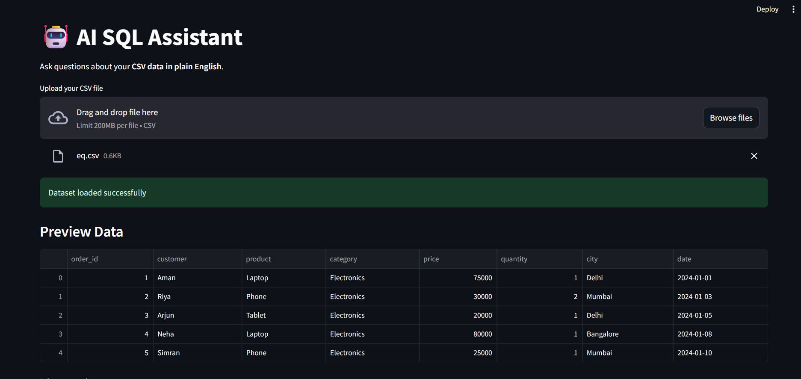

# 🤖 AI SQL Assistant

An **AI-powered data assistant** that lets you interact with your CSV data using **natural language**.
Ask questions in plain English, and the app automatically converts them into SQL queries, executes them, and presents results with **visualizations, insights, and explanations**.

---

## 🚀 Features

### 💬 ChatGPT-Style Interface

- Clean UI with **custom HTML/CSS chat bubbles**
- Interactive conversation flow
- Real-time **streaming responses (typing effect)**

### 🧠 AI Capabilities

- Natural Language → SQL conversion
- Context-aware explanations
- Automatic data insights (like Power BI)

### 📊 Data Features

- Upload **multiple CSV files**
- Switch between datasets easily
- Preview data instantly

### 📈 Visualization

- Auto-generated charts using Plotly
- Smart detection of columns for visualization

### 📥 Export Options

- Download results as:
  - CSV
  - Excel

### 🎙️ Voice Input

- Ask queries using speech
- Converts voice → text → SQL

### 🧠 Auto Insights

- Mean, max, min for numeric columns
- Quick data understanding

---

## 🏗️ Tech Stack

- **Frontend/UI:** Streamlit + Custom HTML/CSS
- **Backend Logic:** Python
- **LLM Integration:** Gemini API
- **Data Handling:** Pandas
- **Visualization:** Plotly
- **Voice Processing:** SpeechRecognition

---

## 📂 Project Structure

```
├── app.py
├── database.py
├── llm.py
├── explain_results.py
├── chart_generator.py
├── utils/
│   └── schema_helper.py
├── .env
├── requirements.txt
└── README.md
```

## 🧪 Example Queries

- "Show total sales by region"
- "Top 5 customers by revenue"
- "Average salary by department"
- "Plot monthly sales trend"

---

## 📸 Screenshots

## 

## 🧠 How It Works

1. User inputs query (text or voice)
2. LLM converts it into SQL
3. SQL runs on uploaded dataset
4. Results displayed + chart generated
5. AI explains output + gives insights

---

## 💡 Future Improvements

- Context-aware follow-up questions
- Multi-user authentication
- Database integration (MySQL/PostgreSQL)
- Dashboard auto-generation
- SaaS deployment

---

## 📄 Resume Description

> Built a ChatGPT-style AI data assistant that converts natural language queries into SQL, supports multi-dataset analysis, voice input, real-time streaming responses, and automated insights with interactive visualizations.

---

## 👨‍💻 Author

**Shivesh Bajpai**
